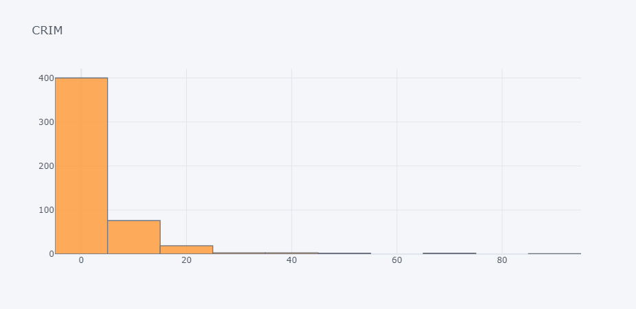
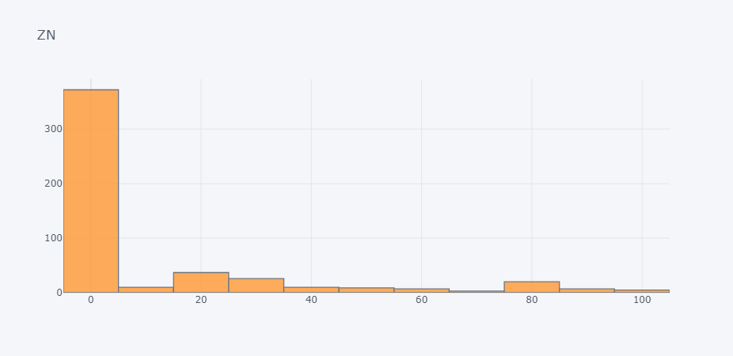
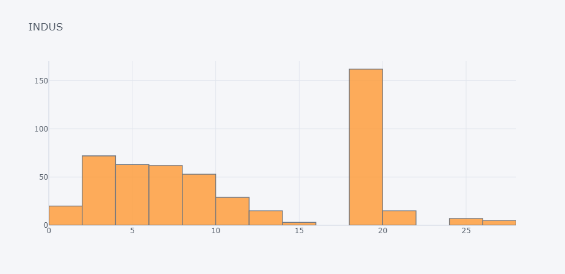

# Boston Housing Dataset

## Content
Each record in the database describes a Boston suburb or town. The data was drawn from the Boston Standard Metropolitan Statistical Area (SMSA) in 1970. The attributes are defined as follows (taken from the UCI Machine Learning Repository1)

## Dataset Details

- **Number of instances:** 506
- **Number of attributes:** 13 numeric/categorical predictive attributes
- **Target variable:** Median value of owner-occupied homes in $1000's (MEDV)

## Attribute Information

- CRIM: per capita crime rate by town
- ZN: proportion of residential land zoned for lots over 25,000 sq.ft.
- INDUS: proportion of non-retail business acres per town
- CHAS: Charles River dummy variable (= 1 if tract bounds river; 0 otherwise)
- NOX: nitric oxides concentration (parts per 10 million)
- RM: average number of rooms per dwelling
- AGE: proportion of owner-occupied units built prior to 1940
- DIS: weighted distances to five Boston employment centers
- RAD: index of accessibility to radial highways
- TAX: full-value property-tax rate per $10,000
- PTRATIO: pupil-teacher ratio by town
- B: 1000(Bk - 0.63)^2 where Bk is the proportion of black people by town
- LSTAT: % lower status of the population

## Target Variable Information

- MEDV: Median value of owner-occupied homes in $1000's

## Dataset Source

The Boston Housing Dataset was obtained from the UCI Machine Learning Repository:
https://archive.ics.uci.edu/ml/machine-learning-databases/housing/

**Plots**

